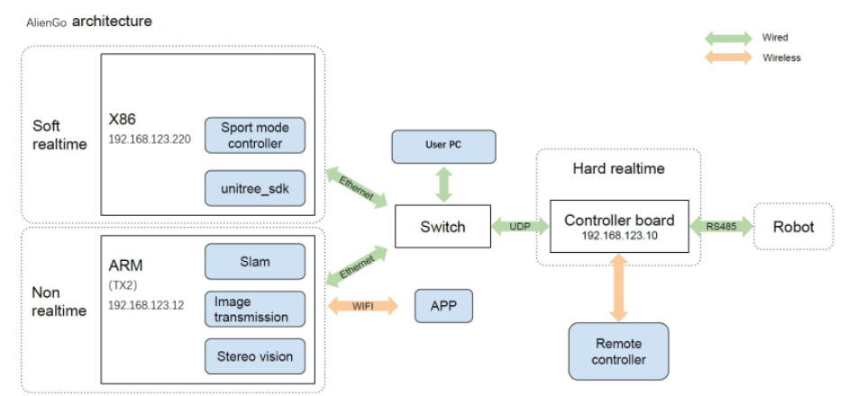

# Aliengo

Если подвигать суставами робота, можно сделать вывод о том, что робот имеет 12 моторов. Все роботы-собаки будут иметь по 12 моторов, однако набор бортовых компьютеров у разных моделей отличается. 

Main control board: MCU (192.168.123.10) Motion control motherboard: Mini PC (192.168.123.220) Sensing motherboard: TX2 (192.168.123.12)

Все компьютеры подключены по Ethernet в одну локальную сеть посредством встроенного хаба. В случае, если вы хотите подключиться к роботу через патч-корд, используйте ethernet-разъем на спине робота. Сетевой адаптер вашего ПК должен быть настроен на автоматическое подключение настроек. 

Существует два абсолютно разных режима работы: либо микроконтроллерная плата производит расчеты и управляет моторами самостоятельно, либо снимает с себя нагрузку по расчетам и делегирует эту работу верхнему уровню, при этом все равно продолжая управлять моторами самостоятельно.

Информация про [Go1](https://robodocs.3logic.ru/docs/Unitree%20Robotics/Go1/go1_arch_&_sdk.html). Здесь всё аналогично, но другие бортовые компьютеры.

## Подключение переферии

Следует учитывать, что внутри Aliengo 3 бортовых компьютера, и разные порты относятся либо к MiniPC (192.168.123.220), либо к TX2 (192.168.123.12)

