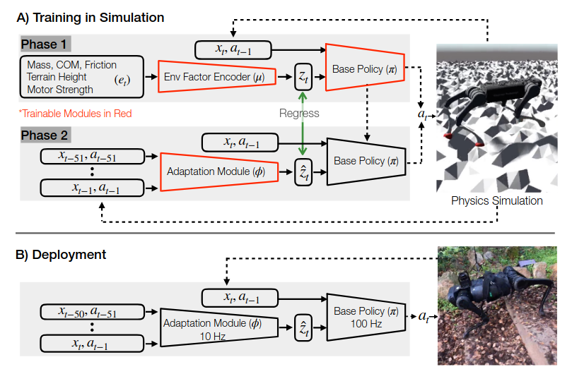
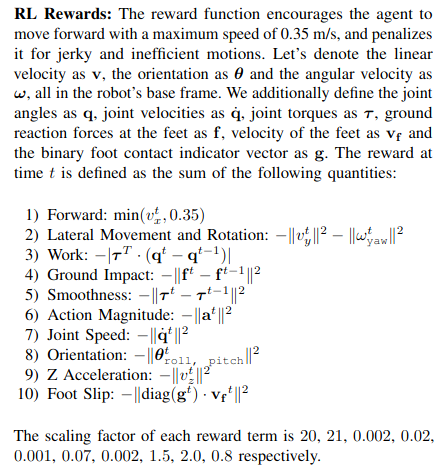

# RMA

Оригинальная [статья](https://ashish-kmr.github.io/rma-legged-robots/rma-locomotion-final.pdf) и [код](https://github.com/antonilo/rl_locomotion)

При обучении в симуляции мы знаем о факторах, которые скрыты от нас в реальности (трение, полезная нагрузка). То есть наблюдения в симуляции и реальности отличаются.
Во-первых, чтобы от различного количества наблюдений в симуляции и реальности модель не менялась (количество входных нейронов), авторы используют не чистые "факторы окружающей среды", а закодированные — выданные кодировщиком "эмбендинги".
Во-вторых, обучают модель адаптации, которая факторы-из-реальности (а точнее историю действий из состояний) преобразует в эмбендинги, соответсвующие закодированным в аналогичном случае факторам-из-симуляции.

## Алгоритм обучения
Обучить нужно и модель базовой политики (ходьбы), и модель адаптации — кодировщик наблюдений.

### Фаза 1. Обучение базовой политики (ходьбы)
Кодировщик наблюдений инициализируем случайно. Он преобразует физически значимые наблюдения (трение и т. д.) в некоторые "эмбендинги".
С помощью обучения с подкреплением RL учим модель, которая на основе:
- "эмбендингов" окружающей среды z_t,
- текущего состояния x_t и
- предыдущего действия a_{t−1}
предсказывает новое действие a_t.
a_t = policy_model(x_t, a_{t-1}, z_t)
Целевая функция — главное идти вперед, не падать и избегать резких движений (не буду вдаваться в детали)

### Фаза 2. Обучение модуля адаптации
Используем обученную в фазе 1 модель базовой политики + кодировщик наблюдений из фазы 1.
С помощью обучения с учителем учим модель, которая из истории состояний x_t и действий a_t учится предсказывать эмбендинги окружающей среды z_t.
Целевая функция — сделать эмбендинги на выходе кодировщика из фазы 1 и модуля адаптации из фазы 2 максимально похожими (минимизация квадрата разности)

## Функция награды

RPY - robot orientation
> roll, pitch, yaw = bodyOrientation_