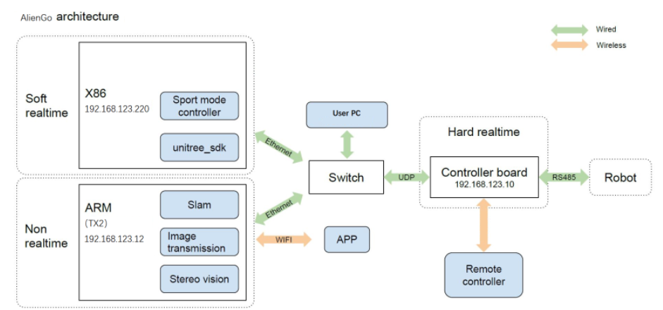

# unitree_legged_sdk

[Официальное сдк](https://github.com/unitreerobotics/unitree_legged_sdk/tree/Aliengo) для управления Unitree Aliengo.

Однако лучше скачать себе ветку Aliengo этого [форка](https://github.com/pendragon707/unitree_legged_sdk), т. к. в нем добавлен python_wrapper для компиляции библиотеки python. В readme также описано, как запустить сдк через docker, чтобы не разбираться со сборкой зависимостей. 

## Введение в СДК

Напомним, что в Aliengo несколько бортовых компьютеров:



Main control board: MCU (192.168.123.10) Motion control motherboard: Mini PC (192.168.123.220) Sensing motherboard: TX2 (192.168.123.12)

Пройдем по пути: unitree_legged_sdk/examples/ Здесь можно видеть файлы примеров содержащие исходный код для управления роботом. Перед компиляцией важно отметить, что примеры разделяются на 2 типа:

- Программы для низкоуровневого управления (например, example_torque.cpp)
- Программы для высокоуровневого управления (например, example_walk.cpp)

Код примеров низкоуровневого управления при исполнении, генерирует и отправляет управляющие пакеты, предназначенные для микроконтроллерной платы (192.168.123.10). При изучении исходников мы можете даже обнаружить этот IP-адрес в виде символьной константы заданной посредством директивы #define. Код низкоуровневого управления оперирует понятиями, наподобии “провернуть мотор в определенное положение”, “развить нужный момент” и т.д.

Код примеров высокоуровневого управления при управлении, генерирует и отправляет управляющие пакеты (уже другого типа), предназначенные для процесса unitree_legged_sport (что тоже работает на самом Raspberry Pi). При изучении исходников, вы можете обнаружить IP-адрес 192.168.123.220, указывающий назначение отправки пакетов. Процесс unitree_legged_sport будет принимать эти пакеты и является своего рода API. Код высокоуровневого управления оперирует понятиями, наподобии “идти вперед”, “повернуть корпус”, “лечь” и т.д. Получив такой пакет, процесс unitree_legged_sport уже сам разберет его на пакеты низкого уровня и отправит их микроконтроллерной плате.

Исходя из такой архитектуры взаимодействия ПО, делаем важный вывод:

- Программы с низкоуровневым управлением запускаются только когда робот находится в стандартном режиме.
- Программы с высокоуровневым управлением запускаются только когда робот находится в спортивном режиме.

    Запуск программы с низкоуровневым управлением в момент работы робота в спортивном режиме приведет к конфликту управления: управляющие команды для микроконтроллерной платы будут поступать не только от вашей программы, но и от процесса unitree_legged_sport. Робот перейдет в аварийный режим, который будет сигнализироваться звуковым сигналом зуммера. В этом случае поскорее завершите программу.

    Запуск программы с высокоуровневым управлением в момент работы робота в стандартном режиме приведет к бездействию робота: управляющие команды для процесса unitree_legged_sport будут игнорироваться, так как процесс в данное время не управляет движением.

После включения робот находится в *стандартном* режиме. Так что после сборки сдк (смотрите readme) можем выполнить low-level пример:

```
cd unitree_legged_sdk/build
./example_position
```

## Управление моторами

Сочлененные двигатели UNitree содержат следующие пять команд управления.
- Угловое положение ротора — q
- Угловая скорость ротора — dq
- Крутящий момент ротора — tau
- Пропорциональный коэффициент ПД-регулятора (коэффициент жесткости) — Kp
- Дифференциальный коэффициент ПД-регулятора (коэффициент затухания) — Kd

Существуют несколько режимов для управления двигателями

- Position mode

В режиме позиционирования выходной вал двигателя стабилизируется в фиксированном положении. 

```
q = q(time)
dq = 0
Kp = Kp_const
Kd = Kd_const
tau = 0
```

- Speed mode

В режиме скорости выходной вал двигателя стабилизируется на фиксированной скорости.

```
q = PosStopF
dq = dq(time)
Kp = 0
Kd = Kd_const
tau = 0
```
В этом режиме tau и kp должны быть установлены равными 0.

- Torque mode

В режиме крутящего момента двигатель будет непрерывно выдавать постоянный крутящий момент. 

```
q = PosStopF
dq = VelStopF
Kp = 0
Kd = 0
tau = tau(time)
```

В гибридном управлении шарнирными двигателями отклонение двигателя в выходном положении возвращается к выходному крутящему моменту с помощью ПД-регулятора.

Суммарный крутящий момент:

```math
out = tau + K_p*(q_{des}-q) + K_d*(dq_{des}-dq)
```

Состоит из:

- ```math tau``` - уменьшает ошибку регулятора, компенсируя известные силы
- ```math K_p*(q_{des}-q)``` - Пропорциональная составляющая
- ```math K_d*(dq_{des}-dq)``` - Дифференциальная составляющая

Документация про [сдк моторов](https://support.unitree.com/home/en/Motor_SDK_Dev_Guide/control_mode)