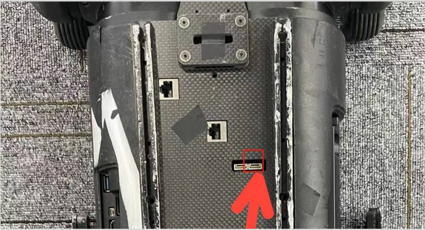
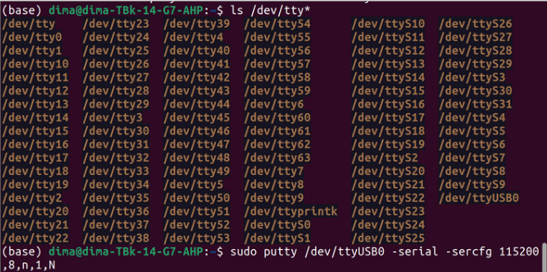

# Содержание
- [Снятие логов c Aliengo](#Снятие логов c Aliengo)
- [Доступ к камере Aliengo](#Доступ к камере Aliengo)

## Снятие логов c Aliengo

1. Подключиться к RS-485 разъёму Aliengo (переходник RS-485 - USB есть в чемодане)



2. При подключении к роботу появляется терминал /dev/ttyUSB0



Установить PuTTY:

```bash
sudo apt update
sudo apt install putty
```

Запустить PuTTY с порта Aliengo

```bash
sudo putty /dev/ttyUSB0 -serial -sercfg 115200,8,n,1,N
```

где:
`/dev/ttyUSB0` - терминал, который появляется при подключении к Aliengo через RS-485
`115200` - скорость передачи данных
`8,n,1,N` - формат кадра
	
После отправки команды появляется окно, в которое в реальном времени выводятся логи:


На основе этих [материалов](https://robodocs.3logic.ru/docs/Unitree%20Robotics/AlienGo/aliengo_get_logs.html)

## Подключение по Wi-Fi

За раздачу Wi-Fi отвечает MiniPC. Подождите 3–5 минут после включения AlienGo, затем подключитесь к точке доступа, предоставленной собакой-роботом.

wi-fi: aliengo-xxx
Пароль: 00000000

## Доступ к камере Aliengo

На Aliengo есть:
- 2 инфракрасные камеры - Intel Realsense D435i 
- Камера одометрии - Intel Realsence T265

Подключиться к голове

ssh unitree@192.168.123.12
123

Запустить RobotVisionSystem

cd RobotVisionSystem
./start.sh

В случае возникновения ошибок 

ps -aux | grep RobotVisionSystem

и убить все процессы, которые будут в списке:
kill -9 <pid>

После попробовать снова запустить

С ноута подключиться к wi-fi, который раздает MiniPC внутри Aliengo (подождать 3-5 минуты после включения)
aliengo....
password: 00000000

В браузере открыть:
http://192.168.123.12:8080/?action=stream

http://192.168.123.12:8080/videolan.html

[Документация](https://unitree-docs.readthedocs.io/en/latest/Aliengo/AlienGo.html)

## Управление через ros noetic

## Запуск аудио

В Aliengo нет встроенных динамиков, но можно подключить свой динамик через один из портов и работать с ним точно так же, как на обычном компьютере с ubuntu.

1. Connect your own computer to the 123 segment network of Aliengo.

```
ping 192.168.123.12
```

Check the sound card id and channel id (usually 2, 0) of the USB Audio Device.

```
aplay -l
```

1. Play audio files by aplay command

```
aplay -D plughw:2,0 xxx.wav
```

Adjust volume: 37 corresponds to 100% volume, 0 corresponds to 0% volume.

```
amixer -c 2 set Speaker 37
amixer -c 2 set Speaker 18
```

If you use aplay to prompt an error audio open

error: Device or resource busy : This situation is caused by the built-in program wsaudio occupying the speaker. We can check the process number and kill it before trying again.

Fix:

```
ps -aux | grep wsaudio
sudo kill -9 PID
```