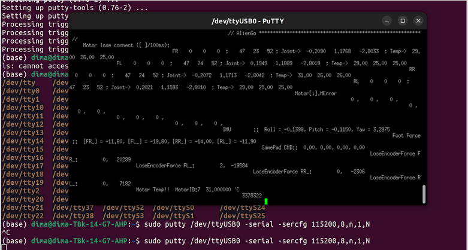

## Содержание
- [Снятие логов c Aliengo](#Снятие логов c Aliengo)
- [Доступ к камере Aliengo](#Доступ к камере Aliengo)

### Снятие логов c Aliengo

1. Подключиться к RS-485 разъёму Aliengo (переходник RS-485 - USB есть в чемодане)


2. При подключении к роботу появляется терминал /dev/ttyUSB0


Установить PuTTY:

```bash
sudo apt update
sudo apt install putty
```

Запустить PuTTY с порта Aliengo

```bash
sudo putty /dev/ttyUSB0 -serial -sercfg 115200,8,n,1,N
```

где:
`/dev/ttyUSB0` - терминал, который появляется при подключении к Aliengo через RS-485
`115200` - скорость передачи данных
`8,n,1,N` - формат кадра
	
После отправки команды появляется окно, в которое в реальном времени выводятся логи:



На основе этих :[материалов](https://robodocs.3logic.ru/docs/Unitree%20Robotics/AlienGo/aliengo_get_logs.html)

## Доступ к камере Aliengo

На Aliengo есть:
- 2 инфракрасные камеры - Intel Realsense D435i 
- Камера одометрии - Intel Realsence T265

